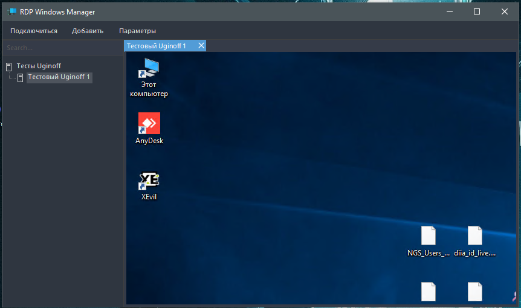
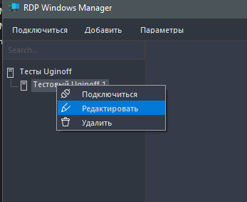

### RDP Windows Manager

 

#### About:
A program created based on the standard Windows control. 
Allows you to open up to 10 or more simultaneous connections, as well as switch between them in a convenient form

### Demo:

### Update v2.0

* Changed design (Remove/edit buttons) Moved to context menu (right-click server in explorer)

* Added possibility to edit category
* Added support for English language

-404040)
